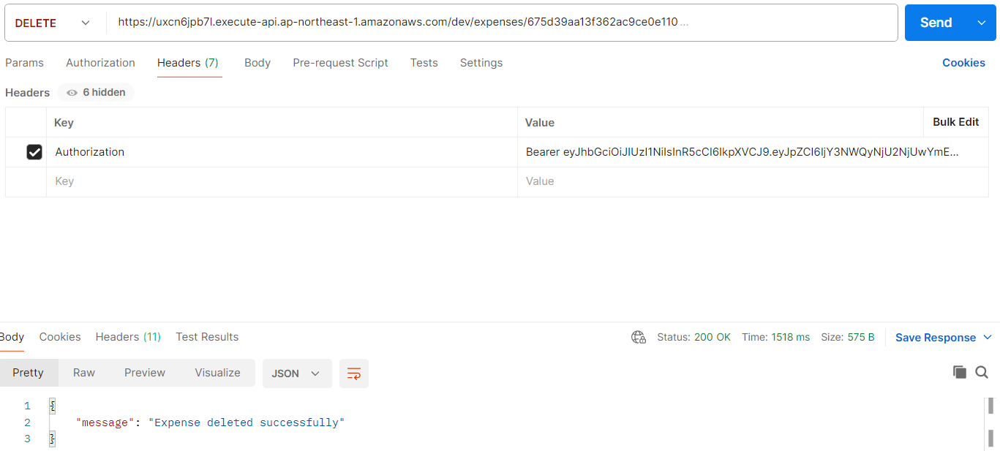
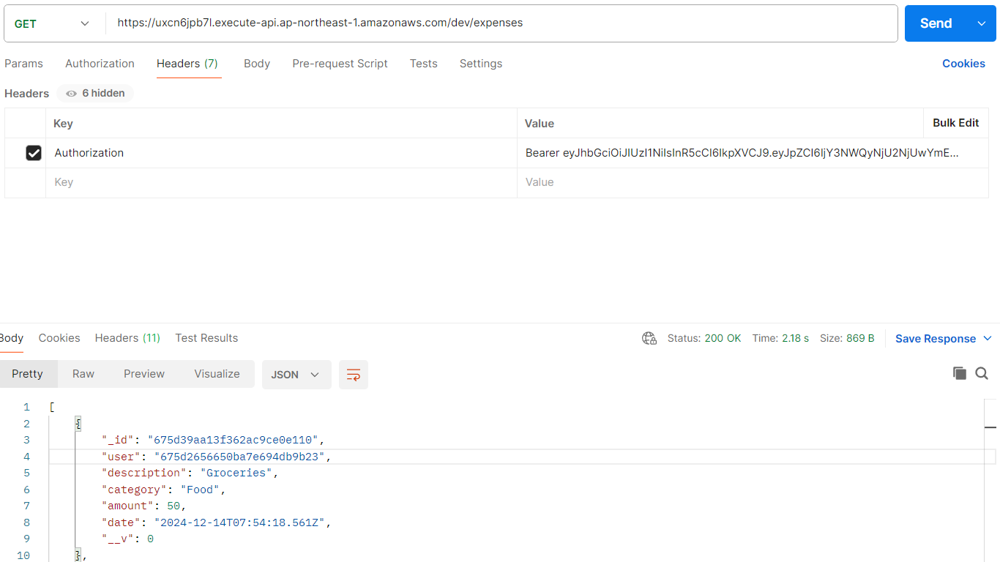
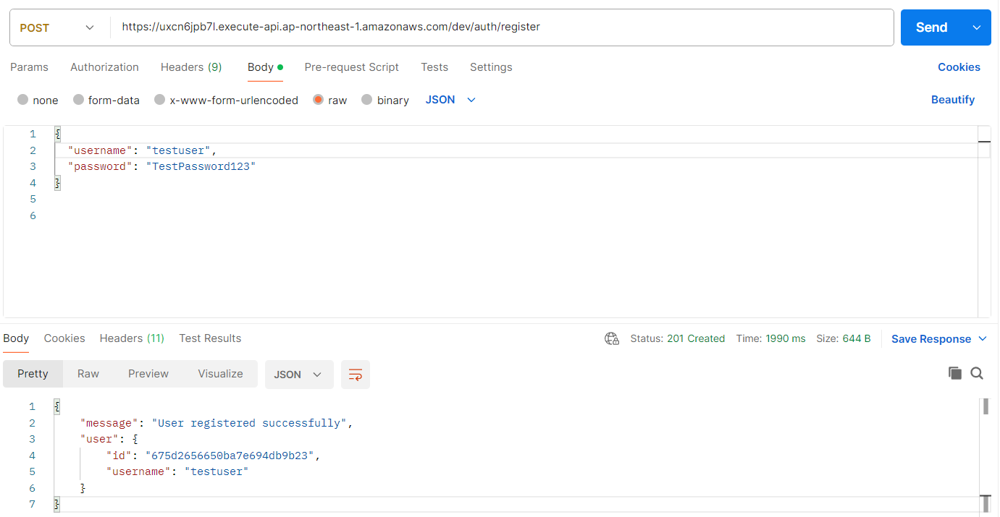
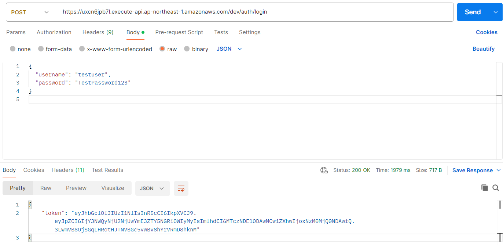

# Finance Tracker

## Project Aim
The aim of this project was to create a fully serverless, secure and scalable REST API for tracking financial data. Furthermore, this projected also served to familarise myself with AWS and its functionalities and how it could be used with a CI/CD pipeline to ensure fast and reliable deployment.

## Technoloies Used
**Backend**: Node.js, AWS Lambda, AWS API Gateway for serverless architecture
**Database**: MongoDB for persistent storage
**Infrastructure**: Serverless Framework v4 for configuration and deployment
**CI/CD**: GitHub Actions for automated testing and continuous deployment
**Testing**: Jest for unit tests and maintaining code quality

## Key Features
**JWT Authentication**: Secure user login and token-based authorization for protected endpoints
**CRUD Endpoints**: Fully implemented create, read, update, and delete operations for expense records
**Serverless Architecture**: No servers to manage, automatic scaling, and cost-efficiency
**Automated Testing & Deployment**: Unit tests run in CI pipeline, ensuring code integrity before automatic deployment to AWS

<table>
  <tr>
    <td>
      <figure>
        
        <figcaption>Adding a New Expense</figcaption>
      </figure>
    </td>
    <td>
      <figure>
        
        <figcaption>Deleting an Expense</figcaption>
      </figure>
    </td>
    <td>
      <figure>
        
        <figcaption>Retrieving Expenses</figcaption>
      </figure>
    </td>
    <td>
      <figure>
        
        <figcaption>Registering a New User</figcaption>
      </figure>
    </td>
    <td>
      <figure>
        
        <figcaption>User Login</figcaption>
      </figure>
    </td>
  </tr>
</table>

